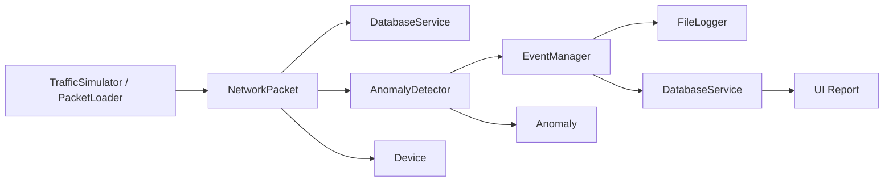

# Система за откриване на мрежови аномалии

Python проект за симулиране на мрежен трафик и детектиране на аномалии като DDoS поведение, сканиране на портове и необичайни размери на пакети.

## Какво прави

- Симулира нормален и атакуващ трафик;
- Открива аномалии чрез правилата и анализ чрез Z-score;
- Записва събития във файл;
- Съхранява пакети, аномалии и устройства в SQLite;
- Осигурява богат TUI за симулация, ръчен вход на данни, зареждане на файлове и отчети.

## Основни класове

### Модели

- `NetworkPacket` - представя един мрежов пакет с IP адреси, протокол, размер, порт, време на засичане и връзка към устройство;
- `Device` - пази обобщена информация за източник на трафик, включително брой пакети, брой аномалии и дали е в черен списък;
- `Anomaly` - описва засечена аномалия с тип, тежест, описание, време на откриване и идентификатор на свързания пакет.

### Обработка и анализ

- `TrafficSimulator` - генерира нормален трафик, DDoS трафик, порт сканиране и комбинирани тестови пакети;
- `PacketLoader` - зарежда пакети от `.json` и `.csv` файлове и валидира стойностите преди обработка;
- `AnomalyDetector` - анализира пакетите по правила и статистика, засича големи пакети, DDoS модели, порт сканиране и Z-score отклонения;
- `TrafficAnalyzer` - дава обобщена статистика като топ източници, групиране по протокол и брой подозрителни пакети.

### Събития, логване и запис

- `EventManager` - управлява абонати за събития и разпраща сигнали при засечена аномалия, съмнителен DDoS трафик или необичаен пакет;
- `FileLogger` - записва аномалии и предупредителни събития в `log.txt`;
- `DatabaseService` - съхранява и извлича пакети, аномалии и устройства от SQLite база `anomalies.db`.

### Интерфейс

- `LiveDetector` - показва потоков изглед по batch-ове и визуализира резултатите от анализа;
- `run_menu()` - управлява интерактивното меню за симулация, ръчно въвеждане, зареждане от файл, отчет и изчистване на базата.

## Как си взаимодействат

1. `main.py` създава `DatabaseService`, `EventManager`, `FileLogger`, `AnomalyDetector`, `LiveDetector`, `TrafficSimulator` и `PacketLoader`.
2. `TrafficSimulator` или `PacketLoader` подават списък от `NetworkPacket` обекти към обработката.
3. За всеки пакет приложението намира или създава `Device` запис и свързва пакета с него.
4. `DatabaseService` записва пакетите в SQLite, а `LiveDetector` извиква `AnomalyDetector` за анализ.
5. `AnomalyDetector` създава `Anomaly` обекти при нарушение на правило или статистическо отклонение.
6. `EventManager` разпраща събитията към абонатите: `FileLogger` пише в `log.txt`, а `DatabaseService` записва аномалиите в базата.
7. `ui/report.py` чете натрупаните данни от базата и ги показва като отчет.



## Оформление на проекта

- `models/` - основни dataclasses;
- `events/` - издаване и абониране на събития;
- `services/` - откриване, анализ, регистриране, зареждане на пакети;
- `simulation/` - генериране на трафик;
- `ui/` - интерфейс на терминала, пряк поток и отчети;
- `data/` - примерни входни файлове;
- `docs/` - архитектура, планиране, тестване и ръководства по операции;

## Стартиране

```bash
python main.py
```

Ако терминалът е интерактивен, менюто се отваря. При неинтерактивни стартирания приложението изпълнява демо по подразбиране и излиза.

## Генерирани файлове

- `log.txt`
- `anomalies.db`

## Ръчен вход

Редактируемите примерни пакети се намират в `data/`. Вижте `docs/manual-data/` за подробни инструкции за зареждане на пакети от менюто или от файлове.
