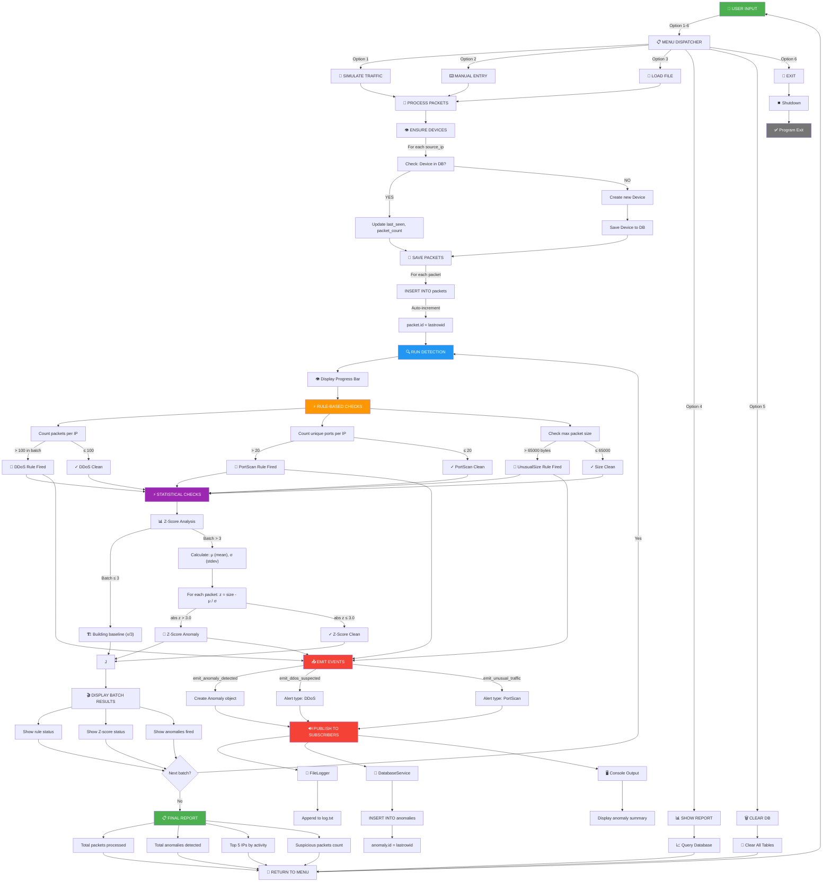
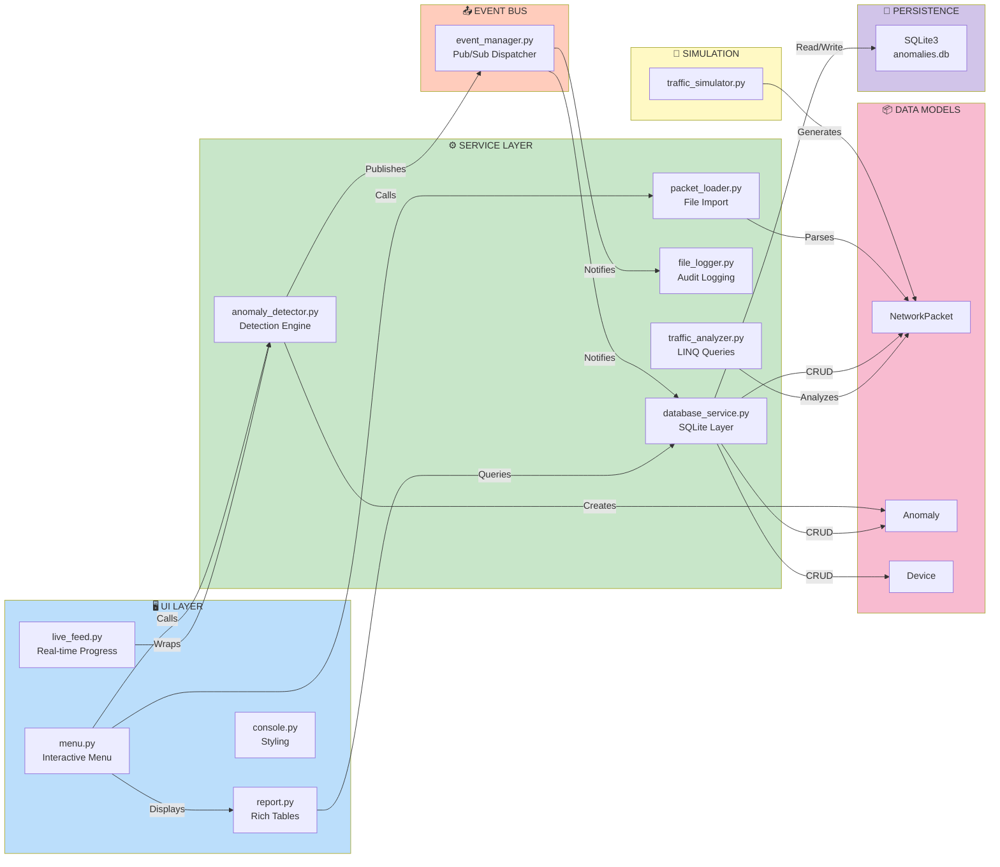
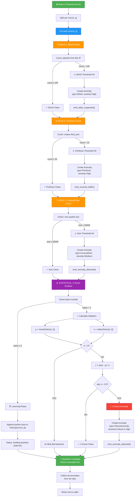
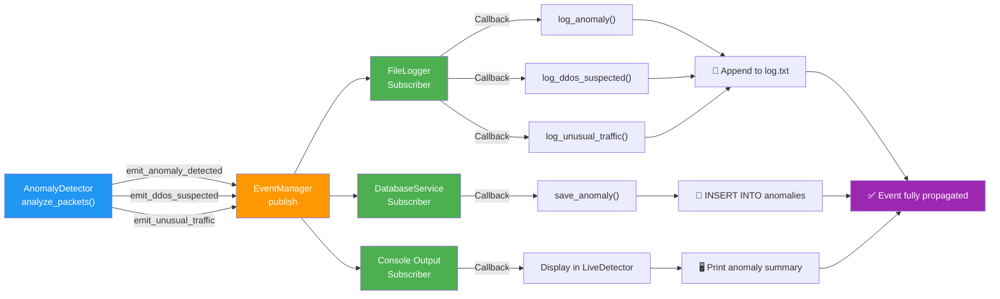
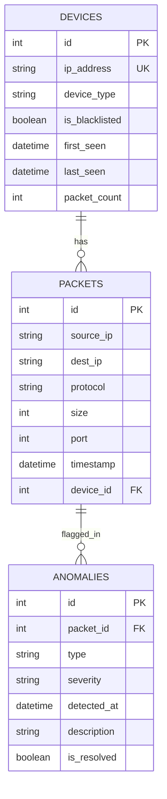

# System Architecture Flow Diagram

## Complete Request-to-Detection Flow

---

## Data Flow Layers

---

## Detection Algorithm Flow

---

## Event Propagation Chain

---

## Database Relationships

